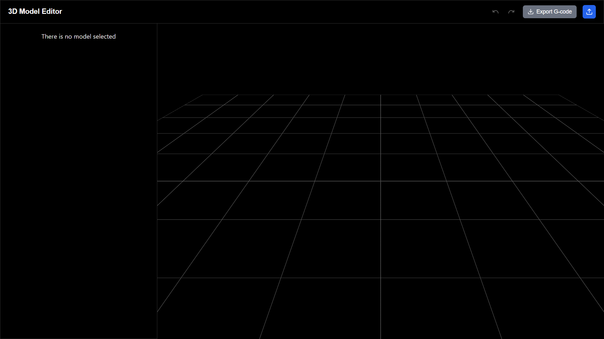
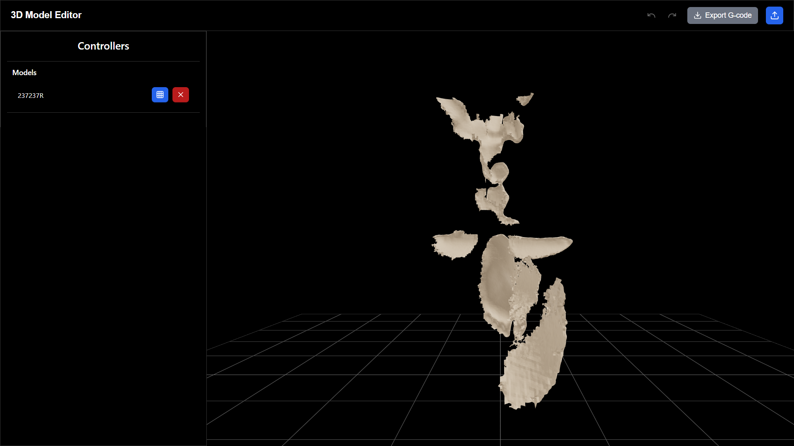
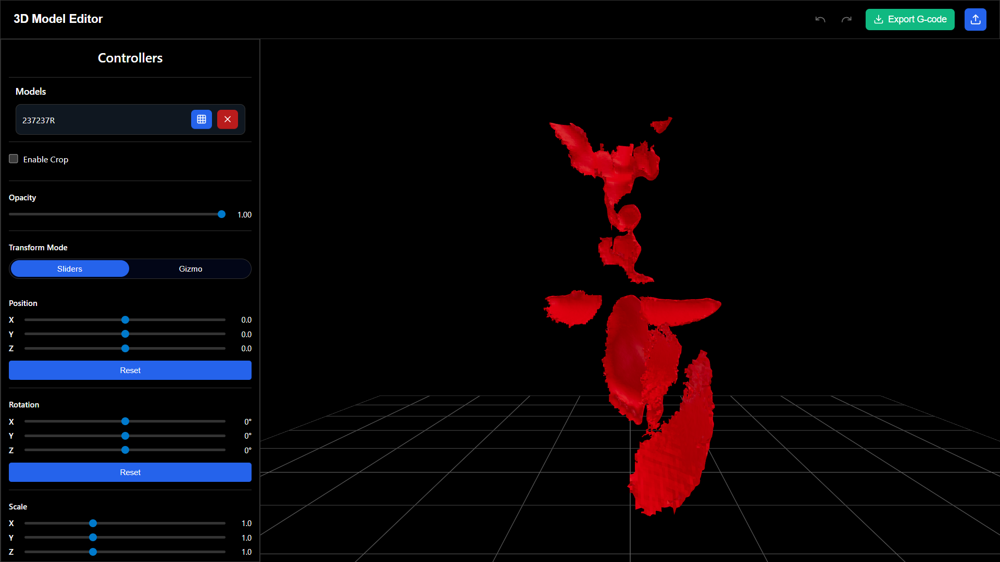
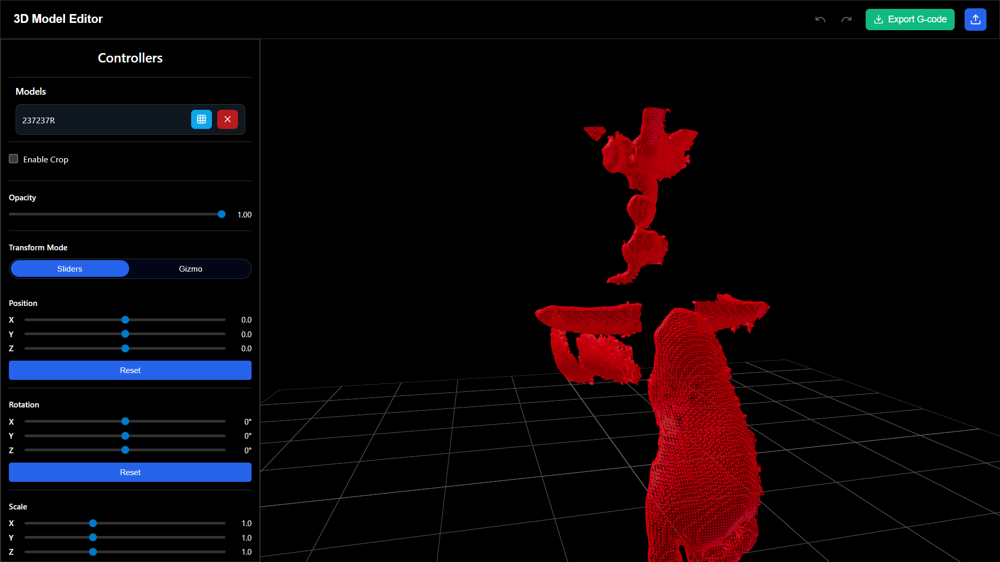
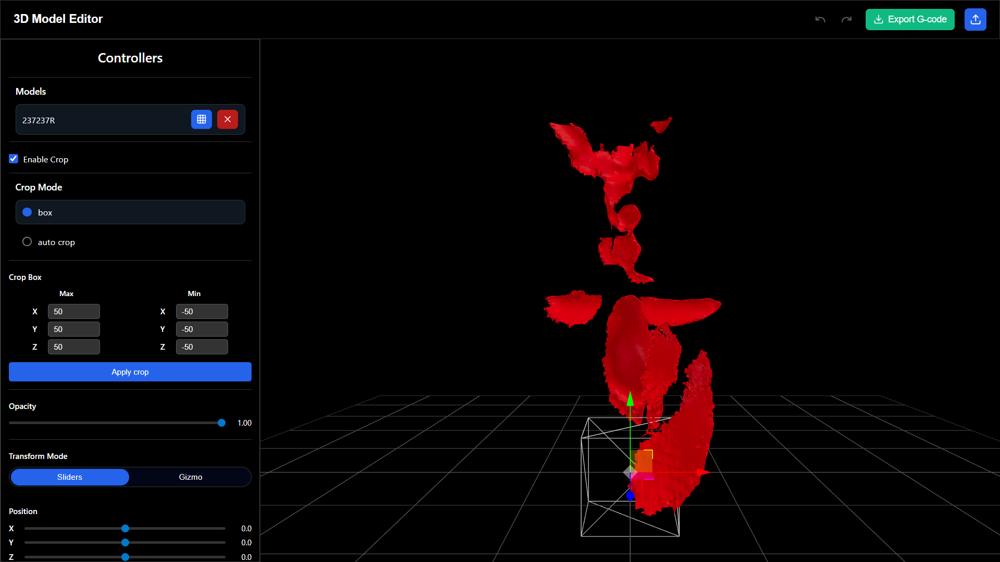

# **Foot Model Editor (Kintec PoC)**

A desktop application Proof of Concept for orthopedic foot and insole modeling.  
The application allows importing 3D foot models (STL), viewing, transforming, cropping, and exporting models for further manufacturing workflows.

***

## **Table of Contents**

*   Overview
*   Tech Stack
*   Features
*   Screenshots
*   Installation
*   Run & Build
*   Prerequisites

***

## **Overview**

This PoC demonstrates a workflow for orthopedic foot modeling using modern web technologies packaged as a desktop app.  
It focuses on **3D visualization**, **model manipulation**, and **cropping tools** for STL files.

***

## **Tech Stack**

*   **Frontend:** React + TypeScript
*   **3D Rendering:** Three.js / React Three Fiber
*   **Desktop Packaging:** Electron
*   **Build Tool:** Vite
*   **State Management:** Zustand

***

## **Features**

✅ Import STL models (from src/assets/Kintec)
✅ 3D view with orbit controls 
✅ Control model opacity
✅ Translate, rotate, and scale models  
✅ Box crop and auto crop  
✅ Undo / redo for cropping  
✅ Auto zoom after import and crop
✅ Preset dimension adjustment for insoles
    (first selected model = foot, second selected model = insole)

***

## **Screenshots**







***

## **Installation**

Clone the repository:

```bash
git clone <repo-url>
cd Kintec-PoC
```

Install dependencies:

```bash
npm install
```

***

## **Run & Build**

Run the application in development mode:

```bash
npm run dev
```

Build the Electron application:

```bash
npm run electron:build
```

***

## **Prerequisites**

Ensure the following are installed:

*   **Node.js v18 or above**
*   **npm** (comes with Node.js)
*   **Git**

Check versions:

```bash
node -v    # Should return v18.x.x or higher
npm -v     # Should return npm version (8.x or higher)
```
